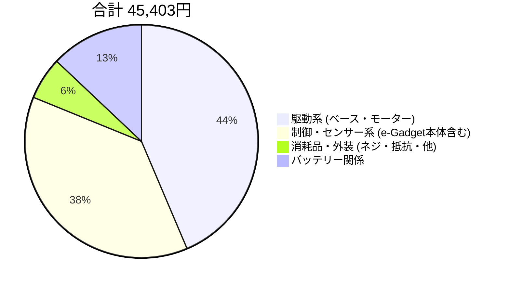

# 追加！！
## [バッテリーバッグ(価格表に入っていない)](https://store.shopping.yahoo.co.jp/storepsn/lipobag-1000.html)

## ここにあるのは部品の価格、商品ページと簡単な説明です

### 価格はほぼ税込価格です

### 主な利用ストアは[[秋月電子通商](https://akizukidenshi.com/catalog/default.aspx)]、[[DAISENネットストア](https://www.daisen-netstore.com)]、[[スイッチサイエンス](https://switch-science.com)]です

> [!TIP]
> 部品名をクリックで商品ページへジャンプ

> [!TIP]
> e-GadgetまたはPico2WHは一台につきどちらか一方を購入すればよい
---

## 一台ずつに必要なもの

### [Li-Po充電池 ￥1,900](https://www.rp-heliport.com/products/detail/13087)

> Li-Po電池　乾電池より強い（笑）

### [オムニロボット用ベースボード ￥2200](https://www.daisen-netstore.com/smartphone/detail.html?id=000000000158)

> DAISEN製オムニロボット用ベースボード　3輪用もあるため間違えないように

### [プラスチックオムニホイール　￥2200x4](https://www.daisen-netstore.com/smartphone/detail.html?id=000000000184)

> DAISEN製プラスチックオムニホイール　アルミ版もあるが高価

### [ロボサイトモーター 60:1　￥2200x4](https://www.daisen-netstore.com/smartphone/detail.html?id=000000000196)

> DAISEN製ロボサイトモーター　安価なTTモーターより高性能

### [Raspberry Pi Pico2WH ￥1710](https://akizukidenshi.com/catalog/g/g130399/)

> Raspberry Pi Pico2Wにピンヘッダーをつけた完成品　Pythonによるプログラミング

### [TB6612 Dual DCモータードライブキット ￥500x2](https://akizukidenshi.com/catalog/g/g111219)

> TB6612を使用した2チャネルモータードライバー　4つモーターを動かすため2枚必要

### [ユニバーサル基板Bタイプ ￥220x3](https://akizukidenshi.com/catalog/g/g103230)

> 部品をまとめるための基本的な基板

### [ホワイトラインセンサー ￥1430x4](https://www.daisen-netstore.com/shopdetail/000000000189)

> ラインセンサー　赤外線発光禁止のためこちら

### [BNO085 9軸センサーフュージョンモジュール ￥4620](https://www.switch-science.com/products/9372)

> 簡単に言うとコンパスセンサー　055より少し上

### [超音波距離センサー HC-SR04 ￥300x4](https://akizukidenshi.com/catalog/g/g111009/)

> 超音波センサー　これがないと距離不明

### [ボールセンサー ￥495x4](https://www.daisen-netstore.com/shopdetail/000000000188/)

> ボールセンサー　遮光しないと環境光に負ける

### [電解コンデンサ1000μF25V105℃ ￥40x4](https://akizukidenshi.com/catalog/g/g117885)

> 回り始めの電流を安定させる

---

## まとめて一セット買えば十分なもの

### [40P ピンソケット ￥80](https://akizukidenshi.com/catalog/g/g105779/)

> ピンヘッダーやジャンパーワイヤーと接続　少し楽になる

### [40P ピンヘッダー ￥35](https://akizukidenshi.com/catalog/g/g100167/)

> ピンソケットと接続

### [100本入 1kΩ抵抗 ￥100](https://akizukidenshi.com/catalog/g/g125102/)

> 1kΩのカーボン抵抗　センサーとマイコンの間に挟む

### [100本入 2.2kΩ抵抗 ￥150](https://akizukidenshi.com/catalog/g/g125222/)

> 2.2kΩのカーボン抵抗　センサーとマイコンの間に挟む

### [充電器(G3 CHARGER) ￥3,978](https://www.monotaro.com/g/07054937/)

> Li-Poの充電器　コスパがちょうどいい

---

## あるといいもの

### [六角オネジ・メネジ ￥30x8](https://akizukidenshi.com/catalog/g/g107319/)

> 片方がオネジ、片方がメネジの六角M3ネジ　基板の固定などに

### [六角両メネジ ￥30x8](https://akizukidenshi.com/catalog/g/g107313/)

> 両方メネジの六角M3ネジ　基板の固定などに

### [10個入 なべ小ネジ￥100](https://akizukidenshi.com/catalog/g/g110245/)

> 基本的なネジ　固定などに

### [100個入 六角ナット ￥650](https://akizukidenshi.com/catalog/g/g111521/)

> 六角ナット　ネジとセットで使用

### [基板用ワンタッチスペーサー ￥30x8](https://akizukidenshi.com/catalog/g/g112347/)

> スペーサー　ネジ穴のない場所への固定など

### [波動スイッチ ￥130x2](https://akizukidenshi.com/catalog/g/g115739)

> 一般的な波動スイッチ　電源スイッチに？

---

## 1. 一台ずつに必要なもの（駆動系）

| 状態 | 項目 | 単価 × 個数 | 小計 |
| :---: | :--- | :--- | :--- |
| [ ] | [オムニロボット用ベースボード](https://www.daisen-netstore.com/smartphone/detail.html?id=000000000158) | ￥2,200 × 1 | ￥2,200 |
| [ ] | [プラスチックオムニホイール](https://www.daisen-netstore.com/smartphone/detail.html?id=000000000184) | ￥2,200 × 4 | ￥8,800 |
| [ ] | [ロボサイトモーター 60:1](https://www.daisen-netstore.com/smartphone/detail.html?id=000000000196) | ￥2,200 × 4 | ￥8,800 |
| **合計** | | 9 | **￥19,800** |

---

## 2. 一台ずつに必要なもの（制御・センサー系）

> バッテリーが入ります

| 状態 | 項目 | 単価 × 個数 | 小計 |
| :---: | :--- | :--- | :--- |
| [ ] | [Raspberry Pi Pico2WH](https://akizukidenshi.com/catalog/g/g130399/) | ￥1,710 × 1 | ￥1,710 |
| [ ] | [TB6612 モータードライブキット](https://akizukidenshi.com/catalog/g/g111219) | ￥500 × 2 | ￥1,000 |
| [ ] | [ユニバーサル基板Bタイプ](https://akizukidenshi.com/catalog/g/g103230) | ￥220 × 3 | ￥660 |
| [ ] | [ホワイトラインセンサー](https://www.daisen-netstore.com/shopdetail/000000000189) | ￥1,430 × 4 | ￥5,720 |
| [ ] | [BNO085 9軸センサー](https://www.switch-science.com/products/9372) | ￥4,620 × 1 | ￥4,620 |
| [ ] | [ボールセンサー](https://www.daisen-netstore.com/shopdetail/000000000188/) | ￥495 × 4 | ￥1,980 |
| [ ] | [超音波センサー](https://akizukidenshi.com/catalog/g/g111009/) | ￥300 × 4 | ￥1200 |
| [ ] | [電解コンデンサ 1000μF](https://akizukidenshi.com/catalog/g/g117885) | ￥40 × 4 | ￥160 |
| [ ] | [バッテリー](https://www.rp-heliport.com/products/detail/13087) | ￥1,900 × 1 | ￥1,900 |
| **合計** | | 20 | **￥18,950** |

---

## 3. まとめて一セット買えば十分なもの（配線・抵抗）

| 状態 | 項目 | 単価 × 個数 | 小計 |
| :---: | :--- | :--- | :--- |
| [ ] | [40P ピンソケット](https://akizukidenshi.com/catalog/g/g105779/) | ￥80 × 1 | ￥80 |
| [ ] | [40P ピンヘッダー](https://akizukidenshi.com/catalog/g/g100167/) | ￥35 × 1 | ￥35 |
| [ ] | [100本入 1kΩ抵抗](https://akizukidenshi.com/catalog/g/g125102/) | ￥100 × 1 | ￥100 |
| [ ] | [100本入 2.2kΩ抵抗](https://akizukidenshi.com/catalog/g/g125222/) | ￥150 × 1 | ￥150 |
| [ ] | [充電器]([https://akizukidenshi.com/catalog/g/g125102/](https://www.monotaro.com/g/07054937/)) | ￥3,978 × 1 | ￥3,978 |
| **合計** | | 5 | **￥4,343** |

---

## 4. あるといいもの（外装・ネジ類）

| 状態 | 項目 | 単価 × 個数 | 小計 |
| :---: | :--- | :--- | :--- |
| [ ] | [六角オネジ・メネジ](https://akizukidenshi.com/catalog/g/g107319/) | ￥30 × 16 | ￥480 |
| [ ] | [六角両メネジ](https://akizukidenshi.com/catalog/g/g107313/) | ￥30 × 16 | ￥480 |
| [ ] | [なべ小ネジ (10個入)](https://akizukidenshi.com/catalog/g/g110245/) | ￥100 × 2 | ￥200 |
| [ ] | [六角ナット (100個入)](https://akizukidenshi.com/catalog/g/g111521/) | ￥650 × 1 | ￥650 |
| [ ] | [基板用ワンタッチスペーサー](https://akizukidenshi.com/catalog/g/g112347/) | ￥30 × 8 | ￥240 |
| [ ] | [波動スイッチ](https://akizukidenshi.com/catalog/g/g115739) | ￥130 × 2 | ￥260 |
| **合計** | | 37 | **￥2,310** |

---

## 総合計

### ￥45,403

## 予算配分

